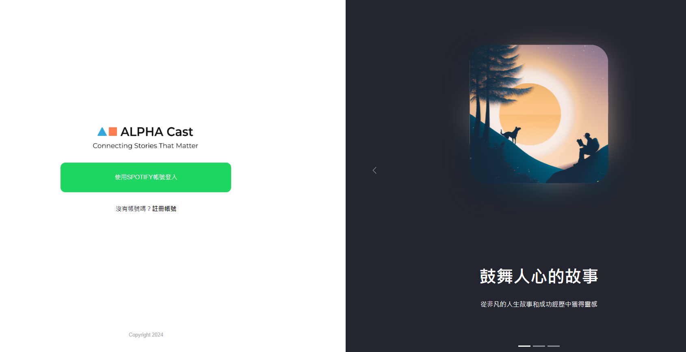

# ALPHA CAST

串接第三方帳號(Spotify)登入，搭配 React 框架所打造出的微型專案。你可以在授權 Spotify 登入後，無須再次註冊，便能開始使用此 App。

功能包含新增、編輯及刪除分類，搜尋 Spotify 上的 Podcast 節目，並加入"已收藏"清單。也串接了 Spotfiy 播放器，讓你可以直接線上收聽。

- Live 網址: [https://alpha-cast.vercel.app/](https://alpha-cast.vercel.app/)
  (需要把帳號加入白名單才能使用

* DEMO 手機版影片: [https://youtu.be/VQozrVkyejw](https://youtu.be/VQozrVkyejw)
* DEMO 電腦版影片: [https://youtu.be/8_O6Ygtt63M](https://youtu.be/8_O6Ygtt63M)

- GitHub: https://github.com/fishiryoma/ALPHAcast

## 目次

- [功能介紹](#功能介紹)
  * [使用 Bootstrap 打造](#使用-bootstrap-打造)
  * [React-route-dom](#react-route-dom)
  * [Axios](#axios)
  * [React](#react)
  * [其他輔助 Library](#其他輔助-library)
- [學習過程](#學習過程)
  * [專案初期](#專案初期)
  * [專案中期](#專案中期)
  * [專案後期](#專案後期)
  * [心得](#心得)
  * [未來規劃](#未來規劃)

## 功能介紹

### 使用 Bootstrap 打造

使用 Bootstrap 快速建立符合設計稿的網站的同時，搭配 inline style 補足 Bootstrap 客製化不足及繁瑣的部分。引入 Bootstrap 的 UI 元件，如 carousel、spinner、button、modal，節省開發時間。但因 Bootstrap 在對應 React 元件上，官網提供的可調參數相對不多，因此適時拆開元件，直接對 html 元件做樣式修改。

### React-route-dom

利用 React-route-dom 達到網頁切換效果。使用 BrowserRouter 建立 Route，並利用 Outlet 功能讓重複的元件如 header & siderbar 不需要被重複撰寫，只需注重在 Outlet 內容的抽換即可。useNavigate, useParams 做網頁的導向，以及從網址欄抓取需要的數據。

### Axios

使用 Axios 向 API 獲取資料。利用 axios.create 功能建立可重複使用的 instance，並利用 request interceptor 功能加入 Authorization，以方便後續管理網頁能一鍵修改。在錯誤處理上，catch 裡使用 throw new Error ，能有效的提示使用者及開發者。

### React

熟用 useState、useEffect。正確把握 React 從渲染開始到 useEffect 的執行順序。利用 useCallback 維持正確資料流，遵守 useEffect dependency。利用 useRef 減少不必要的渲染、使用 error boundary 避免網頁在跳錯時顯示白頁。

### 其他輔助 Library

使用 sweetalert2 套件，有效率快速做出客製化彈出式提示視窗。emoji-picker-react 提供了多樣的圖示選擇，讓網頁在外觀上更活潑。

## 學習過程

### 專案初期

1. 根據設計稿，user story，開始構思要完成這個專案需要用到哪些 library 輔助、網站的架構、哪些屬於一次性元件，哪些是共用元件。user story 要求的功能是需要自己開發，還是可以套用 UI library。
2. 使用 UI 元件的同時，為了符合設計稿，大量閱讀官方文件了解客製化的方法。遇到官方沒有給出能客製化的指引，只能再想別的方法(如:使用 inline-style、再去找別的 library)。

### 專案中期

1. 初期規劃好的網站架構思考不夠周全，有許多沒預料到的共用元件，因此重複花費時間重構網站。
2. Spotify 技術文件沒有讀熟，往往在卡關之後回頭仔細一個字一個字重新閱讀，才發現魔鬼藏在細節裡。
3. React 熟悉度不夠。解決 error 的速度緩慢。尤其在 render 及 useEffect 的執行順序上，因為不熟悉而導致多花了許多時間在做 try & error。

### 專案後期

1. 將重要的功能皆開發完成，推進到專案細節(如:引入 error boundary、API 的錯誤捕捉)。
2. 嘗試提升 code 可讀性。做進一步的元件拆分。
3. 重新檢視命名規則。修改初期思考不周全的不直覺的命名。
4. 設計稿沒有給 mobile 版，因此初期並沒有考量到 RWD，後期才調整 mobile 的排版。
5. 詳讀 react-router 官方文件，初、中期在不熟悉的狀況下，用許多土法煉鋼的方式來實作，後期使用 outlet、useParams 等功能，簡化程式碼。

### 心得

透過這個專案讓自己學習到許多，以為已經掌握的東西，在實際應用時才發現熟悉度不夠，細節沒有注意到就會跳出錯誤。體認到初期規劃的重要性，以及知識廣泛的重要性。如果能夠在初期就熟用許多工具，這個專案大概能省下一半的時間。大多數的時間不是苦惱功能做不出來，而是程式碼跳出無法預期 error，覺得應該要被 re-render 的元件沒有被 re-render ，預期不該被觸發的 effect 被觸發，明顯透露出基礎沒打穩對接下來的影響深遠。

### 未來規劃

比起增加廣泛的知識，應先把 react 基礎熟用。專案中花費許多時間在搞懂 useState、useEffect、useRef、useCallback，下一步想往以節省效能為考量的 useMemo 研讀。React 18 以 function component 為主，但過去 class component 的程式碼不熟悉，在查資料的過程遇到挫折，接下來想更加熟用 Object-Oriented Programming (OOP)。

## 安裝與下載

下載檔案至本地資料夾

```
git clone https://github.com/fishiryoma/ALPHAcast
```

開啟專案資料夾後安裝檔案

```
npm install
```

輸入執行碼

```
npm run dev
```

於瀏覽器輸入以下網址

```
http://127.0.0.1:3000/
```

## 使用工具與版本

- Node.js v16
- React v18
- Vite v5
- Axios v1
- Bootstrap v5
- React-bootstrap v2
- React-router-dom v6
- React-error-boundary v4
- Emoji-picker-react v4
- Js-cookie v3
- React-icons v5
- Sweetalert2 v11
